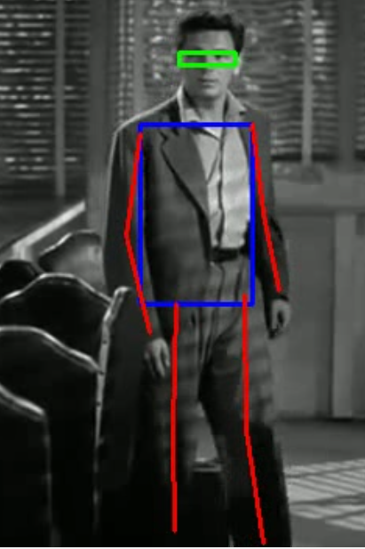

# Pose Detection and Processing

> Turns raw pose keypoints into structured biomechanical features — bounding boxes, limb vectors, and segment lengths — exported to CSV, with an annotated video alongside.

Pose estimators output keypoint coordinates. That's rarely what you want
downstream: for gait analysis, activity recognition, or ergonomics you need
*derived* quantities — how long is the upper arm, which way is it pointing, where
is the head relative to the torso. This script does that conversion, frame by
frame, for every person detected.



## Requirements

```bash
pip install opencv-python numpy pandas
```

Python 3.x. `argparse`, `json`, and `os` are standard library.

## Usage

```bash
python test_code.py \
  --path_to_clip_input  clip_05.mp4 \
  --path_to_clip_output output_clip_05.mp4 \
  --path_to_json        clip_05_pose.json \
  --path_to_csv         clip_05_output.csv
```

| Argument | Purpose |
|---|---|
| `--path_to_clip_input` | Source video |
| `--path_to_clip_output` | Annotated video to write |
| `--path_to_json` | Pose keypoints for that video |
| `--path_to_csv` | Feature table to write |

> All four defaults point at `D:/to_send/…` — a Windows path from the original
> machine. Pass every argument explicitly, or edit the defaults in
> `test_code.py`.

The repo includes a worked example: `output_clip_05.mp4`,
`clip_05_output.csv`, and `clip_05_output.xlsx`. The input video and its pose
JSON are not included.

## How it works

The script takes keypoints as given — it does **not** run a pose estimator. Feed
it JSON from OpenPose, MediaPipe, YOLO-Pose, or similar.

1. **Load** keypoints from the JSON file.
2. **Read** the video frame by frame with OpenCV.
3. For each detected person, per frame:
   - Compute **bounding boxes** for the head and upper body.
   - Compute **unit vectors and lengths** for each limb segment.
   - **Draw** boxes and limb lines onto the frame.
4. **Write** the annotated video and the feature CSV.

### Core functions

```python
unit_vector_and_length(p1, p2)   # → (ux, uy, length)
bounding_box(points)             # → (center_x, center_y, width, height)
```

`unit_vector_and_length` guards against zero-length segments — when two
keypoints coincide (a missed detection), it returns `[0, 0]` instead of dividing
by zero.

Separating **direction** (unit vector) from **magnitude** (length) is the useful
choice here: limb orientation is scale-invariant and comparable across people
and camera distances, while segment length is what changes with perspective.

## Output columns

One row per `(frame_ID, person_ID)`.

| Group | Columns |
|---|---|
| Identity | `frame_ID`, `person_ID` |
| Head box | `head_center_x/y`, `head_width`, `head_height` |
| Body box | `body_center_x/y`, `body_width`, `body_height` |
| Left arm | `left_shoulder_x/y`, `left_shoulder_vec_x/y`, `left_upper_arm_length`, `left_elbow_vec_x/y`, `left_lower_arm_length` |
| Right arm | `right_shoulder_x/y`, `right_shoulder_vec_x/y`, `right_upper_arm_length`, `right_elbow_vec_x/y`, `right_lower_arm_length` |
| Left leg | `left_hip_x/y`, `left_hip_vec_x/y`, `left_upper_leg_length`, `left_knee_vec_x/y`, `left_lower_leg_length` |
| Right leg | `right_hip_x/y`, `right_hip_vec_x/y`, `right_upper_leg_length`, `right_knee_vec_x/y`, `right_lower_leg_length` |
